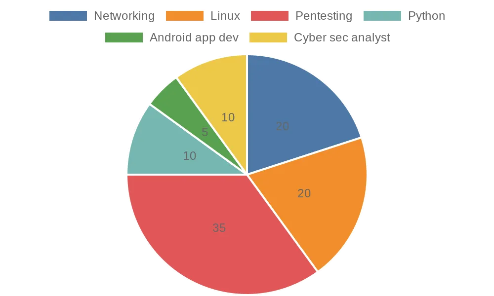

# Hi, I'm Nik! 👋
Ethical Hacker • Cyber Security Enthusiast • Top 3% on TryHackMe

## TryHackMe Profile

Welcome to my GitHub profile! I'm Nik, a passionate cybersecurity aspirant and ethical hacker with a strong interest in developing secure applications and exploring the world of ethical hacking. I love to learn, create, and share my knowledge through various projects.

### 🚀 About Me
- 🎓 Currently pursuing BCA in Cloud & Security.
- 📚 Learning and exploring cybersecurity through various certifications like CEH, CHFI, CCNA, and more.
- 🔍 Focused on CTFs, SIEM systems, android hacking, malware analysis, intrusion detection, IoT hacking, and wireless security.

### 🛠️ Skills & Technologies
- **Programming Languages:** Python, Ruby, C, and C++
- **Cybersecurity Tools:** Metasploit, Nessus, Splunk, Wireshark, Nmap, BurpSuite
- **App Development:** Java, Kotlin, Android Studio.
- **Other Technologies:** Docker, VirtualBox, Git, Linux, IoT

### 📊 Skills Breakdown

### 🔭 Projects & Repositories
- **[EncryptVault](https://github.com/sftp-nik/EncryptVault):** A Python project for encrypting and decrypting files and folders using AES encryption and SHA-512 hashing.
- **[Niks Translator](https://github.com/sftp-nik/Niks-Translator):** A Tkinter-based language translator.
- **[WiFi Deauther](https://github.com/sftp-nik/WiFi-Deauther):** A project using NodeMCU to perform WiFi deauthentication attacks.
- **[Resume Website Template](https://github.com/sftp-nik/Resume-Website-Template):** A simple and elegant HTML template for a personal resume website.

### 📫 How to Reach Me
- **LinkedIn:** [thenikkulkarni](https://www.linkedin.com/in/thenikkulkarni/)
- **GitHub:** [sftp-nik](https://github.com/sftp-nik)
- **Email:** [ssh_nik@proton.me](ssh_nik@proton.me)
- **Instagram:** [the_nikhilkulkarni](https://instagram.com/ssh_nik)

### 🌟 Let's Connect!
I'm always open to discussing new ideas, collaborations, and opportunities in the field of cybersecurity and development. Feel free to reach out to me!
