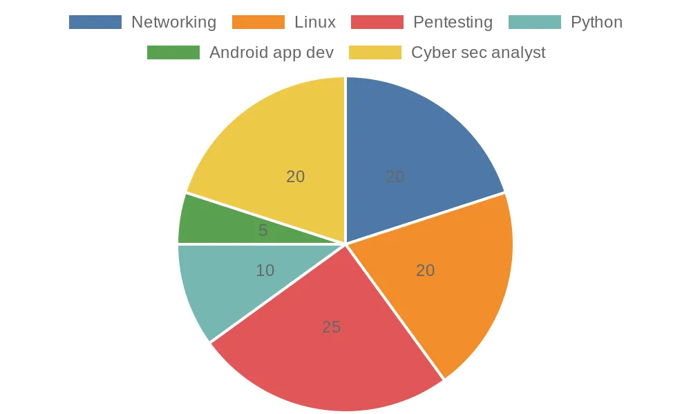

<!-- GitHub Profile README -->
# Hi, I'm Nik! 👋  
**Ethical Hacker • Cyber Security Enthusiast • Top 3% on TryHackMe**

## 🚩 TryHackMe Profile

---

## 🚀 About Me
- 🎓 **Currently pursuing** BCA in Cloud & Security.
- 📚 **Learning and exploring cybersecurity** through certifications like CEH v12, CHFI, and CCNA.
- 🔍 **Special Interests:** CTFs, SIEM systems, Android hacking, malware analysis, intrusion detection, IoT hacking, and wireless security.
- 🌟 **Top Achievement:** Top 3% on TryHackMe.
- 💡 **Philosophy:** "Security is not a product, but a process."  
- 🖥️ **Passion Projects:** Building tools for ethical hacking and contributing to open-source cybersecurity initiatives.

---

## 🛠️ Skills & Technologies
- **Programming Languages:** Python, Ruby, C, C++
- **Cybersecurity Tools:** Metasploit, Nessus, Splunk, Wireshark, Nmap, Burp Suite
- **App Development:** Java, Kotlin, Android Studio
- **Other Technologies:** Docker, VirtualBox, Git, Linux, IoT

### 📊 Skills Breakdown

---

## 🔭 Projects & Repositories
- **[EncryptVault](https://github.com/sftp-nik/EncryptVault):** A Python project leveraging AES encryption for secure file and folder management. 
- **[Niks Translator](https://github.com/sftp-nik/Niks-Translator):** A Tkinter-based multilingual language translator application.
- **[WiFi Deauther](https://github.com/sftp-nik/WiFi-Deauther):** NodeMCU-based tool for WiFi deauthentication attack simulation.
- **[Resume Website Template](https://github.com/sftp-nik/Resume-Website-Template):** A clean and elegant HTML template for personal resumes.
- **[DeepFake Creator](https://github.com/sftp-nik/DeepFake-Creator):** A cutting-edge Python project to generate deepfakes using advanced machine learning algorithms.

---

## 📫 How to Reach Me
- **LinkedIn:** [thenikkulkarni](https://www.linkedin.com/in/thenikkulkarni/)
- **GitHub:** [sftp-nik](https://github.com/sftp-nik)
- **Email:** [ssh_nik@proton.me](mailto:ssh_nik@proton.me)
- **Instagram:** [the_nikhilkulkarni](https://instagram.com/ssh_nik)

---

## 🌟 Let's Connect!
I'm always open to discussing new ideas, collaborations, and opportunities in cybersecurity and development. Feel free to reach out and connect!
